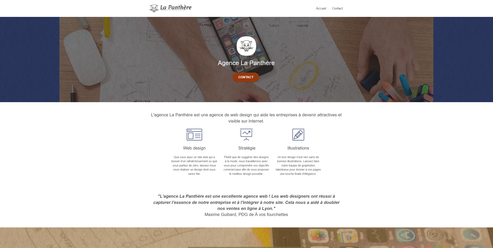

# La-Panthere
Optimisation d'un site web "La Panthere" existant à l'aide de nos connaissance et des outils adaptés

languages : html/css

description : Optimisation d'un site web "La Panthere" existant à l'aide de nos connaissance et des outils adaptés

- Réaliser une recherche des bonnes pratiques en développement web
- Écrire un code HTML et CSS maintenable
- Optimiser la taille et la vitesse d’un site web
- Assurer l'accessibilité d'un site web
- Optimiser le référencement d'un site web

